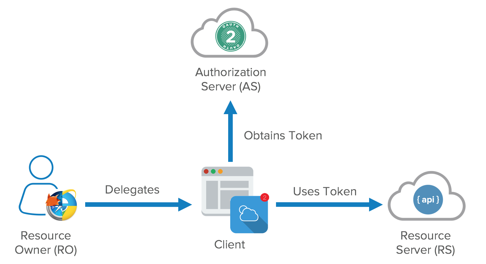
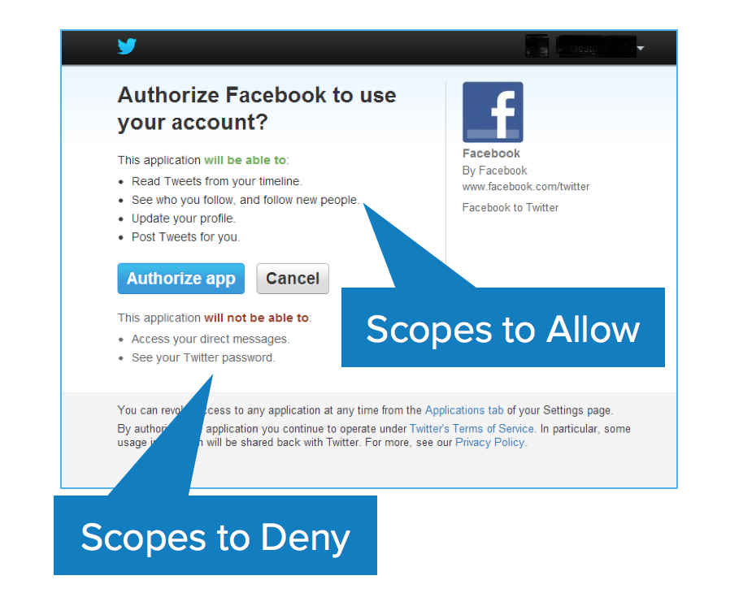
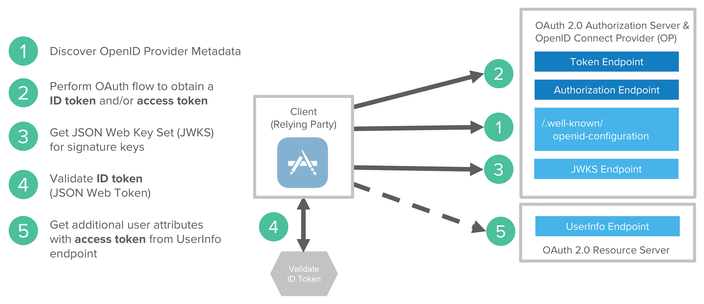

# Identity and Access Management (IAM)

**Disclaimer:** This content has been gathered from lots of different posts!

IAM == Authentication and Authorization

Unlike a traditional monolithic structure that may have a single security portal, microservices pose many problems. Should each service have it’s own independent security firewall? How should identity be distributed between microservices and throughout my entire system? What is the most efficient method for the exchange of user data?

There are smart techniques that leverage common technologies to not only authorize but perform delegation across your entire system.

We implement **OAuth** and **OpenID Connect** flows using **JSON Web Tokens** to achieve the end goal of creating a distributed authentication mechanism for microservices — a process of managing identity where everything is self-contained, standardized, secure, and best of all — easy to replicate.

In this lesson we will learn following:

1. Security claims of microservices architecture
1. OAuth
1. OpenID Connect
1. JWT
1. Common Mistakes
1. Authorization per Microservice
1. Multi-factor Authentication
1. Identity Brokering
1. Threat Model Mitigation

## Security claims of microservice architecture

Before digging into OAuth2; it’s important to clarify the claims to a solid security solution.

1. **Central authentication:**
Since microservices is about building mostly independent and autonomous applications, we want to have a consistent authentication experience, so the user won’t notice his requests are served by different applications with possibly individual security configuration.

1. **Statelessness:**
The core benefit of building microservices is scalability. So the chosen security solution shouldn’t affect this. Holding the users session state on server becomes a tricky task, so a stateless solution is highly preferred in this scenario.

1. **User/machine access distinction:**
There is a need of having a clear distinction of different users, and also different machines. Using microservice architecture leads to building a large multi-purpose data-center of different domains and resources, so there is a need to restrict different clients, such as native apps, multiple SPAs etc. in their access.

1. **Fine-grained access control:**
While maintaining centralized roles, there is a need of configuring detailed access control policies in each microservice. A microservice should be unaware of the responsibility of recognizing users, and must just authorize incoming requests.

1. **Safe from attacks:**
No matter how much problems a security solution may solve, it should be strong against vulnerabilities as best as possible.

1. **Scalability:**
Using stateless protocols is not a warranty of the security solution is scalable. In the end, there should not be any single point of failure. A counter-example is a shared auth database or single auth-server-instance, which is hit once per request.

## OAuth

OAuth should be interpreted not as Authentication, and not as Authorization, but as Delegation. In the web realm, the underlying message is there, yet it also means having the ability to offer, accept, or deny the exchange of data

### OAuth Roles/Actors

OAuth has four main roles/actors:



- Resource Owner (That means, You)
- Client (Means the application you’re using, that accesses your data on the resource server) e.g. web browser
- Resource Server (Where your data are stored) e.g. backend REST API
- Authorization Server (Responsible for authenticating your identity and gives you an authorization token, so that you can request resource server for your data with this token. this token is called `access_token`) → e.g. KeyCloak

#### Clients

Clients can be public and confidential.

##### Confidential Clients

There is a significant distinction between the two in OAuth nomenclature. Confidential clients can be trusted to store a secret. They’re not running on a desktop or distributed through an app store. People can’t reverse engineer them and get the secret key. They’re running in a protected area where end users can’t access them.

##### Public Clients

Public clients are browsers, mobile apps, and IoT devices.

### OAuth Scopes

Scopes are what you see on the authorization screens when an app requests permissions. They’re bundles of permissions asked for by the client when requesting a token. These are coded by the application developer when writing the application.



### OAuth Tokens

#### Access Token And Refresh Token

This two types of token are provided by your authorization server. **`access_token`** is responsible for accessing your resources from the resource server. This token usually has a little validity time. You can access your data with this token a certain time before it gets expired. So after it expires, you need to request Authorization server for a new `access_token` with your **`refresh_token`**, _client id, and client secret_, so that you don’t need to send user credentials again and again. Refresh token has more validation time than Access Token. Typically 7-90 days, depends on you.

So we can say:

- The responsibility of access token is to access data before it gets expired.
- The responsibility of Refresh Token is to request for a new access token when the access token is expired.

Access tokens are the token the client uses to access the Resource Server (API). They’re meant to be short-lived. Think of them in hours and minutes, not days and month. You don’t need a confidential client to get an access token. You can get access tokens with public clients. They’re designed to optimize for internet scale problems. Because these tokens can be short lived and scale out, they can’t be revoked, you just have to wait for them to time out.

The other token is the refresh token. This is much longer-lived; days, months, years. This can be used to get new tokens. To get a refresh token, applications typically require confidential clients with authentication.

Refresh tokens can be revoked. When revoking an application’s access in a dashboard, you’re killing its refresh token. This gives you the ability to force the clients to rotate secrets. What you’re doing is you’re using your refresh token to get new access tokens and the access tokens are going over the wire to hit all the API resources. Each time you refresh your access token you get a new cryptographically signed token. Key rotation is built into the system.

The OAuth spec doesn’t define what a token is. It can be in whatever format you want. Usually though, you want these tokens to be JSON Web Tokens (a standard). In a nutshell, a JWT (pronounced “jot”) is a secure and trustworthy standard for token authentication. JWTs allow you to digitally sign information (referred to as claims) with a signature and can be verified at a later time with a secret signing key.

#### What will happen if my tokens are compromised?

Since you can get access to your data with `access_token`, if it’s compromised then the hacker will get a very limited ability to get access to resources since it’ll be expired very soon.

If the refresh token is compromised, your resources are still safe because client id and client secret are needed to request for `access_token`, to get access to resources.

### OAuth Grant Types / Flows - When and Why

1. Authorization Code
1. Implicit (e.g. browser to keycloak)
1. Resource Owner Password
1. Client Credential (e.g. backend microservice to keycloak)

#### Authorization Code

The Authorization Code flow is the most powerful and most secure by default. When the application redirects the user to the Identity Provider to authenticate, the IdP passes back a short-lived, one-time use authorization code. The application uses the authorization code to retrieve the Access Token.

The important part is twofold:

- First, by the time the user sees the authorization code, it’s already been consumed and therefore can’t be used again.
- Second, the Access Token is kept by the application in the backend. Assuming the application is built securely, a malicious user has to find another way to attack it.

Unfortunately, this doesn’t work for client side applications such as many Javascript apps or most mobile apps as the application itself can be attacked or decompiled for sensitive information. Therefore, we need a different approach.

#### Implicit

The Implicit flow is designed specifically for mobile apps or client side Javascript apps where embedded credentials could be compromised. The mechanics are simple in that the application redirects the user to the Identity Provider to authenticate, the IdP passes back token(s), and the application uses it according to the scopes it has.

Since it’s quite likely that the user could interact with the token(s), it’s important that our use cases reflect that. If we have a banking app, allowing the send_wire_transfers_to_russia scope may be a bad idea unless we have additional factors baked into our authentication process to validate that the right user is using it. The next time you lose your phone, you’ll appreciate that.

As a result, this is often used for OpenID Connect scenarios where a user wants to provide trusted profile information to a third party but not necessarily access or permissions to other systems. Since the underlying concepts are the same and the implementation looks very similar, it’s most of the benefit for the same effort.

#### Resource Owner Password

Compared to the previous grant types, Resource Owner Password makes me nervous. With both the Authorization Code and Implicit flows, the application redirects the user to the Identity Provider to submit their username and password. As a result, the application never sees their credentials. With the Resource Owner Password flow, the application itself accepts the credentials and submits them on behalf of the user.

If the application is malicious or even just poorly developed, it could store those credentials and compromise the user’s information. Therefore, you should only use this if you’re building applications for your users to interact with your legacy systems. For example, a bank may implement this for an internal employee portal.

But remember: Fundamentally, you’re training users to put their credentials into applications they may not trust which is a bad habit at best and a security risk at all times.

#### Client Credential

The Client Credential grant type is designed exclusively for backend server to server operations. Think of it as a server’s username and password. Conceptually, it’s not far from how your application connects to other backend systems such as your database or Twilio. The benefit is that your OAuth provider can return configuration information or other details within the token itself.

Finally, since there’s not a user involved, it doesn’t support OpenID Connect.

It's used for communication from microservices to keycloak.

### OAuth is not an Authentication Protocol

To summarize some of the misconceptions of OAuth 2.0: it’s not backwards compatible with OAuth 1.0. It replaces signatures with HTTPS for all communication. When people talk about OAuth today, they’re talking about OAuth 2.0.

Because OAuth is an authorization framework and not a protocol, you may have interoperability issues. There are lots of variances in how teams implement OAuth and you might need custom code to integrate with vendors.

OAuth 2.0 is not an authentication protocol.

We’ve been talking about delegated authorization this whole time. **It’s not about authenticating the user, and this is key. OAuth 2.0 alone says absolutely nothing about the user. You just have a token to get access to a resource.**

## OpenID Connect

To solve the pseudo authentication problem, the best parts of OAuth 2.0, Facebook Connect, and SAML 2.0 were combined to create OpenID Connect. OpenID Connect (OIDC) extends OAuth 2.0 with a **new signed id_token** for the client and a UserInfo endpoint to fetch user attributes. Unlike SAML, OIDC provides a standard set of scopes and claims for identities. Examples include: profile, email, address, and phone.

Request:

```txt
GET https://accounts.google.com/o/oauth2/auth?
scope=openid email&
redirect_uri=https://app.example.com/oauth2/callback&
response_type=code&
client_id=812741506391&
state=af0ifjsldkj
```

Response:

```txt
HTTP/1.1 302 Found
Location: https://app.example.com/oauth2/callback?
code=MsCeLvIaQm6bTrgtp7&state=af0ifjsldkj
```

The code returned is the authorization grant and state is to ensure it's not forged and it's from the same request.

And the authorization grant for tokens response contains an ID token.

Request:

```txt
POST /oauth2/v3/token HTTP/1.1
Host: www.googleapis.com
Content-Type: application/x-www-form-urlencoded

code=MsCeLvIaQm6bTrgtp7&client_id=812741506391&
  client_secret={client_secret}&
  redirect_uri=https://app.example.com/oauth2/callback&
  grant_type=authorization_code
```

Response:

```json
{
  "access_token": "2YotnFZFEjr1zCsicMWpAA",
  "token_type": "Bearer",
  "expires_in": 3600,
  "refresh_token": "tGzv3JOkF0XG5Qx2TlKWIA",
  "id_token": "eyJhbGciOiJSUzI1NiIsImtpZCI6IjFlOWdkazcifQ..."
}
```

You can see this is layered nicely on top of OAuth to give back an ID token as a structured token. An ID token is a JSON Web Token (JWT). A JWT (aka “jot”) is much smaller than a giant XML-based SAML assertion and can be efficiently passed around between different devices. A JWT has three parts: a header, a body, and a signature. The header says what algorithm was used to sign it, the claims are in the body, and its signed in the signature.

An Open ID Connect flow involves the following steps:

1. Discover OIDC metadata
1. Perform OAuth flow to obtain id token and access token
1. Get JWT signature keys and optionally dynamically register the Client application
1. Validate JWT ID token locally based on built-in dates and signature
1. Get additional user attributes as needed with access token



### The ID Token / Identity Token

You will get id token if you are using scope as openid. Id token is specific to openid scope. With openid scope you can get both id token and access token.

The primary extension that OpenID Connect makes to OAuth 2.0 to enable End-Users to be Authenticated is the ID Token data structure. The ID Token is a security token that contains Claims(claims are name/value pairs that contain information about a user) about the Authentication of an End-User by an Authorization Server when using a Client, and potentially other requested Claims. The ID Token is represented as a JSON Web Token (JWT)

```json
{
   "iss": "https://server.example.com",
   "sub": "24400320",
   "aud": "s6BhdRkqt3",
   "nonce": "n-0S6_WzA2Mj",
   "exp": 1311281970,
   "iat": 1311280970,
   "auth_time": 1311280969,
   "acr": "urn:mace:incommon:iap:silver"
}
```

The above is default JWT claims, in addition to that, if you requested claims from service provider then you will get those as well.

An id_token is a JWT, per the OIDC Specification. This means that:

- identity information about the user is encoded right into the token and
- the token can be definitively verified to prove that it hasn’t been tampered with.

There’s a set of [rules](http://openid.net/specs/openid-connect-core-1_0.html#IDTokenValidation) in the specification for validating an id_token. Among the claims encoded in the id_token is an expiration (exp), which must be honored as part of the validation process. Additionally, the signature section of JWT is used in concert with a key to validate that the entire JWT has not been tampered with in any way.

## JWT

JSON Web Tokens, commonly known as JWTs, are tokens that are used to authenticate users on applications. This technology has gained popularity over the past few years because it enables backends to accept requests simply by validating the contents of these JWTs. That is, applications that use JWTS no longer have to hold cookies or other session data about their users. This characteristic facilitates scalability while keeping applications secure.

It contains:

- **user's identity** (subject id, name, group, roles, etc.) and
- some **metadata** relatives to the authorization process (issuer, time to live, etc.).

!!! note
    JWT Are Signed! Not Encrypted.

A JSON Web Token is comprised of three parts:

- the header,
- payload, and
- Signature.

The format of a JWT is `header.payload.signature`.

The very important thing to note here, is that, this token is signed by the HMACSHA256 algorithm, and the header and payload are Base64URL encoded, it is not encrypted. If I go to jwt.io, paste this token and select the HMACSHA256 algorithm, I could decode the token and read its contents. Therefore, it should go without saying that sensitive data, such as passwords, should never be stored in the payload.

During the authentication process, when a user successfully logs in using their credentials, a JSON Web Token is returned and must be saved locally (typically in local storage). Whenever the user wants to access a protected route or resource (an endpoint), the user agent (e.g. browser) must send the JWT, usually in the Authorization header using the Bearer schema, along with the request.

When a backend server receives a request with a JWT, the first thing to do is to validate the token. This consists of a series of steps, and if any of these fails then the request must be rejected. The following list shows the validation steps needed:

1. Check that the JWT is well formed.
1. Check the signature.
1. Validate the standard claims.
1. Check the Client permissions (scopes).

JSON Web Token (JWT) is an open standard (RFC 7519) that defines a compact and self-contained way for securely transmitting information between parties as a JSON object. This information can be verified and trusted because it is digitally signed. JWTs can be signed using a secret (with the HMAC algorithm) or a public/private key pair using RSA.

Token based authentication schema’s became immensely popular in recent times, as they provide important benefits when compared to sessions/cookies:

- CORS
- No need for CSRF protection
- Better integration with mobile
- Reduced load on authorization server
- No need for distributed session store

Some trade-offs have to be made with this approach:

- More vulnerable to XSS attacks
- Access token can contain outdated authorization claims (e.g when some of the user privileges are revoked)
- Access tokens can grow in size in case of increased number of claims
- File download API can be tricky to implement
- True statelessness and revocation are mutually exclusive

JWT Authentication flow is very simple:

- User obtains Refresh and Access tokens by providing credentials to the Authorization server
- User sends Access token with each request to access protected API resource
- Access token is signed and contains user identity (e.g. user id) and authorization claims.

### Anatomy of a JWT

If you encounter a JWT in the wild, you’ll notice that it’s separated into three sections, the header, payload, and signature. (Follow along with Stormpath’s open-source Java JWT tool as we dissect the anatomy of a JWT!) Here’s an example of a typical JWT:

```txt
eyJ0eXAiOiJKV1QiLCJhbGciOiJIUzI1NiJ9
.
eyJzdWIiOiJ1c2Vycy9Uek1Vb2NNRjRwIiwibmFtZSI6IlJvYmVydCBUb2tlbiBNYW4iLCJzY29wZSI6InNlbGYgZ3JvdXBzL2FkbWlucyIsImV4cCI6IjEzMDA4MTkzODAifQ
.
1pVOLQduFWW3muii1LExVBt2TK1-MdRI4QjhKryaDwc
```

In this example, Section 1 is a header which describes the token. Section 2 is the payload, which contains the JWT’s claims, and Section 3 is the signature hash that can be used to verify the integrity of the token (if you have the secret key that was used to sign it).

When we decode the payload we get this nice, tidy JSON object containing the claims of the JWS:

```json
{
  "sub": "users/TzMUocMF4p",
  "name": "Robert Token Man",
  "scope": "self groups/admins",
  "exp": "1300819380"
}
```

The claims tell you, at minimum:

- Who this person is and the URI to their user resource (the sub claim)
- What this person can access with this token (the scope claim)
- When the token expires. Your API should be using this when it verifies the token.

Because the token is signed with a secret key you can verify its signature and implicitly trust what is being claimed.

Within the payload, there are a number of keys with values. These keys are called **claims** and the JWT specification has seven of these specified as “registered” claims. They are:

```txt
iss  Issuer
sub  Subject
aud  Audience
exp  Expiration
nbf  Not Before
iat  Issued At
jti  JWT ID
```

When building a JWT, you can put in any custom claims you wish. The list above simply represents the claims that are reserved both in the key that is used and the expected type.

### JWT Size

- The biggest disadvantage of token authentication is the size of JWTs.
- A session cookie is relatively tiny compared to even the smallest JWT.
- Depending on your use case, the size of the token could become problematic if you add many claims to it. Remember, each request to the server must include the JWT along with it.

### Where to store JWT?

- Commonly, the JWT is placed in the browser's **local storage** and this works well for most use cases. Unlike cookies, local storage is sandboxed to a specific domain and its data cannot be accessed by any other domain including subdomains.
- You can store the token in a **cookie** instead, but the max size of a cookie is only 4kb so that may be problematic if you have many claims attached to the token
- Additionally, you can store the token in **session storage** which is similar to local storage but is cleared as soon as the user closes the browser.

## Common mistakes

Here is a brief list of the very major things a developer should be aware of.

1. **Using the same signing key for production and staging:**
It is strictly recommended to use different signing keys as much as possible. Once a signing key gets into wrong hands, it is possible to generate full access granting key without knowing login credentials of any user.

1. **Not using TLS:**
If an attacker manages to intercept an access token, he will gain all the rights authorized to this token, until the token expires. There are a lot of ways to achieve that, in particular when there is no TLS encryption. This was not a problem in the days of version 1 of OAuth, because protocol level encryption was forced.

1. **Using access tokens in URL:**
As of standard, access tokens can be either passed by URL, in headers, or in a cookie. From the TLS point of view, all three ways are secure. In practice passing tokens via URL is less secure, since there several ways of getting the URL from records.

1. **Switching to symmetric signing keys:**
RSA is not required for JWT signing, and Spring Security does provide symmetric token signing as well; which does solve some problems, which make development harder. But this is insecure, since an attacker just needs to get into one single microservice to be able to generate its own JWT tokens.

The biggest complaint about OAuth in general comes from Security people. It’s regarding the Bearer tokens and that they can be passed just like session cookies. You can pass it around and you’re good to go, it’s not cryptographically bound to the user. Using JWTs helps because they can’t be tampered with. However, in the end, a JWT is just a string of characters so they can easily be copied and used in an Authorization header.

## Authorization per Microservice

Each microservice should not have to do its own authentication, but it does need to do its own authorization.

Each API should keep track of its own object-level permissions, and it can do so without anything more than a pre-validated userid or groupid. Simply record an object or row that has the id of the object, the id of the user or group, and a set of flags for which permissions they have on that object. That way, when a user tries to do an action on an object, we can join to the appropriate permissions object if it exists, and determine what the user can and can't do to that object. The point is, object-level-permissions exists in the microservice database store without extra user context.

Using this approach we do not require extra user information for authorization such as the username and/or email address - that information is stored elsewhere and only required for authentication.

However, Authentication and Authorization are often mixed – which can lead to serious complexity problems down the line. While Authentication answers the question “who are you?”, Authorization is about the question “what can you do?”. Authentication makes a naturally bounded context (or logical service), in that it has a closed role and needs minimal other information, but Authorization is not that simple. The challenge with Authorization is that in order to answer the question “what can you do?”, the system must have knowledge of what things are possible to do. A very common anti-pattern is the creation of an “Authorization Service”, in an attempt to put Authorization concerns into a single place. This can be appealing on the grounds that all the information about a concept is grouped together, however this means that the “Authorization Service” must know about all the functionality of every other service, and the business rules around who can invoke this functionality and based on what conditions. This is a very common source of major architectural problems, as a result of individual services being unable to perform their job autonomously, and a single service (Authorization) having an intimate knowledge of the workings of other services. The purpose when designing services in a service-oriented or microservices architecture is to create independent logically bounded components, that can version independently, and function in isolation. At runtime, service boundaries form fault partitions, where if one service is offline, other services should be able to continue to work. Allowing a single service to hold knowledge about other services violates these principles.

## Multi-factor Authentication

Multi-factor Authentication (MFA) is a method of verifying a user's identity by requiring them to present more than one piece of identifying information. This method provides an additional layer of security, decreasing the likelihood of unauthorized access. The type of information required from the user is typically two or more of the following:

- **Knowledge**: Something the user knows (e.g. a password)
- **Possession**: Something the user has (e.g. a cell phone)
- **Inheritance**: Something the user is (e.g. a fingerprint or retina scan)

## Identity Brokering

An Identity Broker is an intermediary service that connects multiple service providers with different identity providers. As an intermediary service, the identity broker is responsible for creating a trust relationship with an external identity provider in order to use its identities to access internal services exposed by service providers.

From a user perspective, an identity broker provides a user-centric and centralized way to manage identities across different security domains or realms. An existing account can be linked with one or more identities from different identity providers or even created based on the identity information obtained from them.

An identity provider is usually based on a specific protocol that is used to authenticate and communicate authentication and authorization information to their users. It can be a social provider such as Facebook, Google or Twitter. It can be a business partner whose users need to access your services. Or it an be a cloud-based identity service that you want to integrate with.

### KeyCloak

When using KeyCloak as an identity broker, users are not forced to provide their credentials in order to authenticate in a specific realm. Instead, they are presented with a list of identity providers from which they can authenticate.

You can also configure a default broker. In this case the user will not be given a choice, but instead be redirected directly to the parent broker. The following diagram demonstrates the steps involved when using KeyCloak to broker an external identity provider:


1. User is not authenticated and requests a protected resource in a client application.
1. The client applications redirects the user to KeyCloak to authenticate.
1. At this point the user is presented with the login page where there is a list of identity providers supported by a realm.
1. User selects one of the identity providers by clicking on its respective button or link.
1. KeyCloak issues an authentication request to the target identity provider asking for authentication and the user is redirected to the login page of the identity provider. The connection properties and other configuration options for the identity provider were previously set by the administrator in the Admin Console.
1. User provides his credentials or consent in order to authenticate in the identity provider.
1. Upon a successful authentication by the identity provider, the user is redirected back to KeyCloak with an authentication response. Usually this response contains a security token that will be used by KeyCloak to trust the authentication performed by the identity provider and retrieve information about the user.
1. Now KeyCloak is going to check if the response from the identity provider is valid. If valid, it will import and create a new user or just skip that if the user already exists. If it is a new user, KeyCloak may ask the identity provider for information about the user if that info doesn’t already exist in the token. This is what we call identity federation. If the user already exists KeyCloak may ask him to link the identity returned from the identity provider with his existing account. We call this process account linking. What exactly is done is configurable and can be specified by setup of First Login Flow . At the end of this step, KeyCloak authenticates the user and issues its own token in order to access the requested resource in the service provider.
1. Once the user is locally authenticated, KeyCloak redirects the user to the service provider by sending the token previously issued during the local authentication.
1. The service provider receives the token from KeyCloak and allows access to the protected resource.

As you may notice, at the end of the authentication process KeyCloak will always issue its own token to client applications. What this means is that client applications are completely decoupled from external identity providers. They don’t need to know which protocol (eg.: SAML, OpenID Connect, OAuth, etc) was used or how the user’s identity was validated. They only need to know about KeyCloak.

## Threat Model Mitigation

- [KeyCloak Threat Model Mitigation](https://access.redhat.com/documentation/en-us/red_hat_single_sign-on/7.0/html/server_administration_guide/threat_model_mitigation)
- [https://tools.ietf.org/html/rfc6819](https://tools.ietf.org/html/rfc6819)

## Others

### What are the 3 tokens?

OAuth2 had these two tokens:

(1). Access Token

Access tokens are used as bearer tokens. A bearer token means that the bearer (who hold the access token) can access authorized resources without further identification. Because of this, it’s important that bearer tokens are protected. If I can somehow get ahold of and “bear” your access token, I can pretend as you.

These tokens usually have a short lifespan (dictated by its expiration) for improved security. That is, when the access token expires, the user must authenticate again to get a new access token limiting the exposure of the fact that it’s a bearer token.

(2). Refresh Token

OpenId Connect adds this 3rd token:

(3). ID Token

So, you can see auth is added by OpenID Connect

### Scopes vs Claims

A scope represents the access authorization associated with a particular token with respect to resource servers, resources, and methods on those resources. Scopes are the OAuth way to explicitly manage the power associated with an access token. A scope can be controlled by the authorization server and/or the end user in order to limit access to resources for OAuth clients that these parties deem less secure or trustworthy.

Claims are name/value pairs that contain information about a user.

### How does the Resource Server validate the access token with the Auth Server?

Two options here. The OAuth specification does not dictate the format for tokens and as such, they are considered "opaque".

- In this case, the Resource Server must make an introspect request of the Authorization Server to get back the information (like scopes and timeout) that the token represents.
- However, the second approach is now more prevalent and is used by most. In this case, the access token is a JWT that has a signature computed using the RS-256 algorithm and a private key used by e.g. KeyCloak. The resource server can use the corresponding public key (which it can obtain using the metadata from the well known endpoint to validate the access token WITHOUT having to make the introspect request of the Authorization Server. This saves a lot of network traffic.

### Does the Resource Server need to validate the access token every time?

Yes. But, HOW the validation is done is dependent on the formatting of the token.

### How does the whole workflow look like?

This diagram depicts pretty nicely:


### Is it permissible for the access token to be a JWT?

Using a JWT as an access token is certainly permissible by spec exactly because the spec does not restrict its format.

### If it is permissible according to the spec, are there any additional considerations that would make using a JWT as an access token a bad idea?

The idea behind using a JWT as an access token is that it can then be self-contained so that the target can verify the access token and use the associated content without having to go back to the Authorization Server. That is a great property but makes revocation harder. So if your system requires a capability for immediate revocation of access, a JWT is probably not the right choice for an access token (though you can get pretty far by reducing the lifetime of the JWT).

The trick to revocation is to use a refresh token. The refresh token is supplied by the Authorization Server at the same time as your JWT access token, but has a much longer lifetime and - crucially - can only be used in a request to the Authorization Server to get a new access token (without user interaction). E.g. the AS issues a refresh token that lasts 5 hours and an access JWT that lasts 5 minutes. You get 5 minutes worth of requests with no slow AS calls, and a chance to revoke every 5 minutes (when the Access Token expires and the Refresh token is used to request a new one from the AS)

### What is purpose of Redirect URI?

A redirect URI helps to detect malicious clients and prevents phishing attacks from clients attempting to trick the user into believing the phisher is the client. The value of the actual redirect URI used in the authorization request has to be presented and is verified when an authorization "code" is exchanged for tokens. This helps to prevent attacks where the authorization "code" is revealed through redirectors and counterfeit web application clients. The authorization server should require public clients and confidential clients using the implicit grant type to pre-register their redirect URIs and validate against the registered redirect URI in the authorization request.

### What is bearer token?

A 'bearer token' is a token that can be used by any client who has received the token (e.g., [RFC6750]). Because mere possession is enough to use the token, it is important that communication between endpoints be secured to ensure that only authorized endpoints may capture the token. The bearer token is convenient for client applications, as it does not require them to do anything to use them (such as a proof of identity). Bearer tokens have similar characteristics to web single-sign-on (SSO) cookies used in browsers.

### What will be API flow?

Here is an example flow:


The process is following:

1. The user is signing in on the client app. He is redirected to the Keycloak login page. He can use his credentials or use a third party identity provider (depending the IAM configuration).
1. Once logged, Keycloak is issuing an access token and a refresh to the user.
1. Both tokens are saved by the client app for the next usage.
1. Now the client application can access to the API by filling the Authorization http header with the access token. The access token is short-lived and must be refreshed before its expiration date. So the client app should verify each time that the access token is not about to expire. In this case, the client app shall use the refresh token to claim a new access token to Keycloak.
1. Kong validates the access token. It verify the signature, the issuer and the expiration time of the token.
1. If everything is ok, Kong transfers the request to the backend service. The access token is still carried by the the Authorization header and can be decoded by the backend services to gather information required by the fine grained authorization layer (subject id, group, roles). Note than Kong add the client app ID into the header. This can be useful to the backend service in order to identify where the user comes from.
1. And the service response is transmitted to the client app through all layers.

## References

- [What the Heck is OAuth?](https://developer.okta.com/blog/2017/06/21/what-the-heck-is-oauth)
- [Identity Brokering](https://access.redhat.com/documentation/en-us/red_hat_single_sign-on/7.0/html/server_administration_guide/identity_broker)
