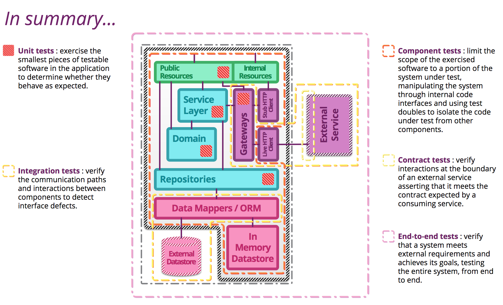

# Microservices Testing

how to test microservices based applications?

> There has been a shift in service based architectures over the last few years towards smaller, more focussed "micro" services. There are many benefits with this approach such as the ability to independently deploy, scale and maintain each component and parallelize development across multiple teams. However, once these additional network partitions have been introduced, the testing strategies that applied for monolithic in process applications need to be reconsidered.

Unit tests are fast to execute, give the right level of feedback about what is broken. As you go up the pyramid, the tests are slower and it becomes harder to point out root cause of failures because the surface area is larger.

Its essential point is that you should have many more low-level unit tests than high level end-to-end tests running through a GUI.

A common problem is that teams conflate the concepts of end-to-end tests, UI tests, and customer facing tests. These are all orthogonal characteristics. For example a rich javascript UI should have most of its UI behavior tested with javascript unit tests using something like Jasmine. A complex set of business rules could have tests captured in a customer-facing form, but run just on the relevant module much as unit tests are.

> I always argue that high-level tests are there as a second line of test defense. If you get a failure in a high level test, not just do you have a bug in your functional code, you also have a missing or incorrect unit test. Thus I advise that before fixing a bug exposed by a high level test, you should replicate the bug with a unit test. Then the unit test ensures the bug stays dead.

# Microservices can usually be split into similar kinds of modules

* **Resources** act as mappers between the application protocol exposed by the service and messages to objects representing the domain. Typically, they are thin, with responsibility for sanity checking the request and providing a protocol specific response according to the outcome of the business transaction.

* Almost all of the service logic resides in a **domain model** representing the business domain. Of these objects, **services** coordinate across multiple domain activities, whilst **repositories** act on collections of domain entities and are often persistence backed.

* If one service has another service as a collaborator, some logic is needed to communicate with the external service. A gateway encapsulates message passing with a remote service, marshalling requests and responses from and to domain objects. It will likely use a client that understands the underlying protocol to handle the request-response cycle.

* Except in the most trivial cases or when a service acts as an aggregator across resources owned by other services, a micro-service will need to be able to persist objects from the domain between requests. Usually this is achieved using object relation mapping or more lightweight data mappers depending on the complexity of the persistence requirements. Often, this logic is encapsulated in a set of dedicated objects utilised by repositories from the domain.

* A resource receives a request and once validated, calls into the domain to begin handling of the request.

* If many modules must be coordinated to complete the business transaction, the resource delegates to a service. Otherwise, it communicates directly with the relevant module.

* Connections out to external services require special attention since they cross network boundaries. The system should be resilient to outages of remote components. Gateways contain logic to handle such error cases. Typically, communications with external services are more coarse grained than the equivalent in process communications to prevent API chattiness and latency.
  
* Similarly, communications with external datastores have different design considerations. Whilst a service is often more logically coupled to its datastore than to an external service, the datastore still exists over a network boundary incurring latency and risk of outage.
  
* The presence of network partitions affects the style of testing employed. Tests of these modules can have longer execution times and may fail for reasons outside of the team's control.

### Internal Resources 

are useful for more than just testing...

Though it may seem strange, exposing internal controls as resources can prove useful in a number of cases besides testing such as monitoring, maintenance and debugging. The uniformity of a RESTful API means that many tools already exist for interacting with such resources which can help reduce overall operational complexity.

The kinds of internal resources that are typically exposed include logs, feature flags, database commands and system metrics. Many microservices also include health check resources which provide information about the health of the service and its dependencies, timings for key transactions and details of configuration parameters. A simple ping resource can also be useful to aid in load balancing.

Since these resources are more privileged in terms of the control they have or the information they expose, they often require their own authentication or to be locked down at the network level. By namespacing those parts of the API that form the internal controls using URL naming conventions or by exposing those resources on a different network port, access can be restricted at the firewall level.

# Testing Strategies for Microservices

## 1. Unit Tests

Unit tests : exercise the smallest pieces of testable software in the application to determine whether they behave as expected.

**Unit tests** are written to test the behavior of small pieces of your application in isolation (say, a method, or a function, or the interactions between a small group of them). They can usually be run without starting the whole application. They do not hit the database (if your application has one), the filesystem, or the network. They don’t require your application to be running in a production-like environment. Unit tests should run very fast—your whole suite, even for a large application, should be able to run in under ten minutes.

### Testing domain or business function

The code in your microservice that performs business function should not make calls to any services external to the application. This code can be tested by using unit tests and a testing framework such as JUnit1. The unit tests should test for behavior and either use the actual objects (if no external calls are needed) or mock the objects involved in any operations.

When writing tests using the actual objects, a simple JUnit test suffices. For creating mocks of objects, you can either use the built-in capabilities of Java EE or use a mocking framework. The @Alternatives annotation2 in the Context and Dependency Injection (CDI) specification enables injection of mock objects instead of the actual beans. Plenty of mocking frameworks are available for Java. For example, JMockit3 is designed to work with JUnit to allow you to mock objects during testing. In the most basic test using JMockit, you can create mocked objects by using the @Mocked annotation and define behavior when this object is called by using the Expectations() function.

## 2. Integration Tests

Integration tests are used to test the interactions between all the services in the system. The in-depth behavior of the individual services has already been tested at this stage. The consumer driven contract tests should have ensured that the services interact successfully, but these tests identify bugs that have been missed. The tests should check the basic success and error paths of service communication with the application deployed. Use the test data as discussed in the previous section.

Rather than testing all of the services at once, it might still be necessary to mock out some of the services during testing. Test the interaction of two specific services, or a small set of services, adding in mocked behavior when calls are made to outside the set. Mocking the calls to the services outside the group under test is done in the same way as the unit tests on the APIs. The same techniques that are used to start and stop the server or container for contract testing also apply here. 

Integration tests : verify the communication paths and interactions between components to detect interface defects.

Integration tests are used to verify the communication across network boundaries. They should test the basic success and failure paths in an exchange. Integration tests can either be run in the same way as unit tests, or by standing up the application on a running server. To run integration tests without starting the server, call the methods that carry JAX-RS annotations directly. During the tests, create mocks for the objects that the resource classes call when a request comes in.

Integration tests should validate the basic success and error paths of the application. Incorrect requests should return useful responses with the appropriate error code.

### 2.1 Gateway Integration Tests

To verify integration with external gateways or other systems.

#### Testing external service requests

Inevitably, your microservice must make calls to external services to complete a request, such as calls to other microservices in the application or services external to the application. The classes to do this construct clients that make the requests and handle any failures. The code can be tested by using two sets of integration tests: One at the single service level and one in the staging environment. Both sets test the basic success and error handling of the client.

The integration tests at the single service level do not require the service under test or the external services to be deployed. To perform the integration tests, mock the response from the external services. If you are using the JAX-RS 2.0 client to make the external requests, this process can be done easily by using the JMockit framework

### 2.2 Persistence Integration Tests

To verify integration with databases.

In a microservice architecture, each microservice owns its own data. If you follow this guideline, the developers of a microservice are also responsible for any external data stores used. The code that makes requests to the external data store and performs data mapping and validation is contained in the repositories layer. When testing the domain logic, this layer should be mocked. Tests for data requests, data mapping, and validation are done by using integration tests with the microservice and a test data store deployed locally or on a private cloud. The tests check the basic success and error paths for data requests. If the data mapping and validation for your application requires extensive testing, consider separating out this code and testing it using a mocked database client class. 

#### Test data 

The local version of the data store must be populated with data for testing. Think carefully about what data you put in the data store. The data should be structured in the same way as production data but should not be unnecessarily complicated. It must serve the specific purpose of enabling data request tests. 
 
## 3. Component tests

**Component tests** test the behavior of several components of your application. Like unit tests, they don’t always require starting the whole application. However, they may hit the database, the filesystem, or other systems (which may be stubbed out). Component tests typically take longer to run.

Component tests are designed to test an individual microservice as one piece. The component is everything inside the network boundary, so calls to external services are either mocked or are replaced with a “test-service.” There are advantages and disadvantages to both scenarios.

**Using mocks**

By mocking the calls to external services, you have fewer test objects to configure. You can easily define the behavior of the mocked system by using frameworks like JMockit, and no tests will fail due to network problems. The disadvantage of this approach is that it does not fully exercise the component because you are intercepting some of the calls, increasing the risk of bugs slipping through.

**Test services**

To fully exercise the communication boundaries of your microservice, you can create test services to mimic the external services that are called in production. These test services can also include a test database. The test services can also be used as a reference for consumers of your microservice. The disadvantage of this system is that it requires you to maintain your test services. This technique requires more processor cycles than maintaining a mocking system as you must fully test the test microservice and create a deployment pipeline.

After you are using a mocking framework for other levels of testing, it makes sense to reuse those skills. However, if you do take the mocking approach, you must make sure that the tests in your staging environment exercise inter-service communications effectively. 
    
Limit the scope of the exercised software to a portion of the system under test, manipulating the system through internal code interfaces and using test doubles to isolate the code under test from other components.

## 4. Contract tests

Verify interactions at the boundary of an external service asserting that it meets the contract expected by a consuming service.

Every service that consumes another service or resource should have a set of contract tests that are run against that resource (especially in staging environments). Given that services evolve independently over time, it is important to ensure that the consumer's contract continues to be satisfied.

These tests are specifically written by the consumer (the client side), and are run and managed as part of the test suite for the consuming service. 

Classes that expose JAX-RS endpoints or receive events should be tested by using two types of tests: Integration tests and contract tests.

### 4.1 Consumer Driven Contracts
  
It's nearly impossible for you to know all the ways consumers might use your services. With a [consumer-driven contract](http://martinfowler.com/articles/consumerDrivenContracts.html) model, it's the consumer's responsibility to provide a suite of tests that specify what types of interactions are needed and in which format. Your service would then agree to this contract and ensure that it's not broken. This gets rid of dependencies on other services. This approach also enables you to verify that the contract is being fulfilled at build time.

Tools like [Pact](https://github.com/realestate-com-au/pact) will give you a better understanding of how you can achieve this type of functionality for developing and testing microservices. Once you have a consumer-driven contract process in place, the next key step in testing microservices is to shift-right into the previously forbidden world of production.

A consumer of a particular service has a set of input and output attributes that it expects the service to adhere to. This set can include data structures, performance, and conversations. The contract is documented by using a tool like Swagger. Generally, have the consumers of a service drive the definition of the contract, which is the origin of the term consumer driven contract.

Consumer driven contract tests are a set of tests to determine whether the contract is being upheld. These tests should validate that the resources expect the input attributes defined in the contract, but also accepts unknown attributes (it should just ignore them). They should also validate that the resources return only those attributes that are defined in the documentation. To isolate the code under test, use mocks for the domain logic.

Maintaining consumer driven contract tests introduces some organizational complexity. If the tests do not accurately test the contract defined, they are useless. In addition, if the contract is out of date, then even the best tests will not result in a useful resource for the consumer. Therefore, it is vital that the consumer driven contract is kept up to date with current consumer needs and that the tests always accurately test the contract.

Contract tests require the actual API to be implemented. This technique requires the application be deployed onto a server.  Use tools such as the Swagger editor4 to create these tests. The Swagger editor can take the API documentation and produce implementations in many different languages. 

Another dimension to contract testing is the tests that are run by the consumer. These tests must be run in an environment where the consumer has access to a live version of the service, which is the staging environment. 

## 5. End-to-end tests

Verify that a system meets external requirements and achieves its goals, testing the entire system, from end to end.

End-to-end testing is essential to find the bugs that were missed previously. End-to-end tests should exercise certain “golden paths” through the application. It is unrealistic to test every path through the application with an end-to-end test, so identify the key ones and test those.

A good way to identify these paths through the environment is to review the key external requirements of an application. For example, if your application is an online retail store you might test the following paths:

- User logs in
- User purchases an item
- User views the summary of the order
- User cancels the order

End-to-end testing should also include the user interface. Tools such as SeleniumHQ or Cypress can be used to automate interactions with a web browser for testing.

E2E tests are run in mock/stage environment.

### Mock / Stage Environment

This section defines a staging environment as a test environment that is identical (where possible) to the production environment. The build pipeline deploys successfully tested microservices to the staging environment where tests are run to verify the communication across logical boundaries, that is, between microservices. 

#### Test data 

The staging environment should include any data stores that will be in your production system. The data in this data store will be more complete than at the individual microservice level, as these tests are testing more complicated interactions. Use tools to inject data into tests for you. Tools allow you to have more control over the flow of data around the system

## 6. Synthetic Transactions (Tests running production)

Tests carried out on the live production system. They could be set of E2E tests which are continuously running in production and then raise alerts if something fails.
 
## 7. Stress/Load testing
   
Microservices should be able to handle unexpected loads. Stress testing should be used to test the bulk heads in your microservices. If a particular microservice is holding up requests, look at the configured bulk heads.

Gatling is a good tool!

Tests should be automated as part of the build, release, run (delivery) pipeline.

These three sets of tests, combined, should provide an extremely high level of confidence that any introduced change has not broken existing functionality.

## 8. E2E Automation tools
### Selenium
Selenium WebDriver is the open source automation tool we all know and love. With a history starting from the humble beginnings of IDE and transforming into Selenium 2.0 a.k.a. Selenium WebDriver, Selenium has become a foundation of many modern software teams' test automation toolkits.

Most are familiar with Selenium's use — it makes direct calls to the browser using each browser's native support for automation. By writing a script in Selenese using the compatible programming languages, you can run tests that work as if you were driving the browser yourself.

While the learning curve can be steep for Selenium and requires the knowledge of at least one programming language, it has a vast community of active users and even boasts an annual user conference.

#### PROS
* Support multiple languages such as ruby, java , C#, python,perl, php
* Crossbrowser & paralell testing through saucelab, browserstack
* Support multiple automation frameworks such as PageObjectModel, Cucumber, testng etc etc

#### CONS
* Window based application can't be automated
* Not suitable for Angular based application
* Difficult to manage tool dependencies & libraries
* Selenium doesn't directly talk to browser
* By default no video capturing, if you are running tests in headless browser

### Cypress
So how is Cypress different from Selenium, and how is it the same?

First, Cypress is said to have an easier onboarding than Selenium, where all you need to do is install the .exe to get up and running sine all the drivers and dependencies are automatically installed. With Selenium, on the other hand, you need to spend a little more time getting everything up and running.

Cypress almost acts as a "freemium" model. Similiar to Selenium which is entirely open sourced unless you integrate with a paid tool, you can also add to Cypress's core capabilities by leveraging the paid dashboard which includes a test runner that allows you to easily debug tests with DOM snapshots and includes video storage for private projects.

Selenium and Cypress differ in the way of their architecture, as well. Selenium is made up of bindings, or libraries, and the WebDriver, which controls the browsers. These two components work through the JSON network.

Alternatively, while Cypress is used for UI testing, it uses its own unique DOM manipulation and runs directly in the browser with no network communication. Cypress is often cited as a developer-friendly test automation tool for this reason since this often causes frustrations for them in Selenium.

Having a different architecture on top of an Electron app also allows Cypress to be so close to the web application under test that we can do things that you can't do in Selenium such as stubbing DOM APIs.

#### PROS
* No need to worry about synchronization issue especially visibility of elements, button or any DOM elements
* Easy to setup test development environment through just one click
* Ability to capture video recording of tests and it's very useful when tests would have been running in headless browser
* Cypress dashboard service
* Execution of tests is extremely fast because cypress directly talks to browsers
* Stubbing DOM APIs
* Most suitable to Reactjs based application

#### CONS
* Window based application can't be automated
* Only support chrome browser, so it's crossbrowser compatibility testing is not possible
* Doesn't work out of the box with OAuth/OpenID
* Only support javascript language for test development
* Only support Mocha & Chai framework
* Cypress doesn't handle redirects within your applications. Such as if you are going to automate google
  & facebook login scenarios in your application through cypress then you are going have a deep trouble. 
  You will have to write hooks or stubs to achieve this but it's a daunting task

 **If you don't know what you're doing when it comes to building out a test automation framework, Cypress may be a good option**

# References

* https://martinfowler.com/articles/microservice-testing/
* https://www.thoughtworks.com/insights/blog/architecting-continuous-delivery
* https://vrockai.github.io/blog/2017/10/28/cypress-keycloak-intregration/
